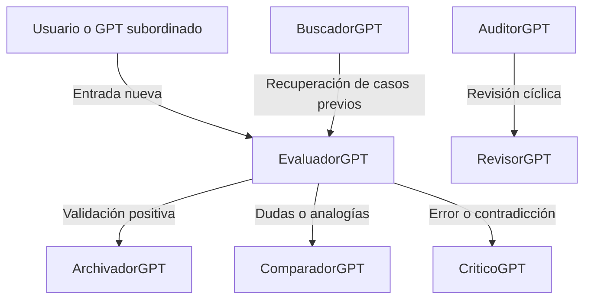

# 🧠 PROMPTs — GPTs Subordinados Palma39

Este directorio contiene los archivos PROM (Prompt Role Operational Modules) que definen el comportamiento, funciones, interacción y autoridad de los GPTs subordinados que componen el sistema Palma39.

Cada archivo incluye la lógica de activación, sus funciones, campos que evalúa, relaciones con la base de memoria y vínculo con otros agentes.

---

## 📂 PROMs disponibles

| Nombre del PROM        | Rol principal                           | Estado     | Versión |
|------------------------|------------------------------------------|------------|---------|
| `evaluador-gpt.md`     | Validación de entradas                   | activo     | v1.1    |
| `comparador-gpt.md`    | Análisis semántico y redundancia         | activo     | v1.0    |
| `auditor-gpt.md`       | Coherencia, obsolescencia, decisiones    | activo     | v1.1    |
| `buscador-gpt.md`      | Consulta estructurada y analógica        | activo     | v1.0    |
| `critico-gpt.md`       | Análisis profundo y detección de sesgos  | activo     | v1.0    |
| `archivador-gpt.md`    | Grabación final en la memoria viva       | activo     | v1.1    |
| `revisor-gpt.md`       | Reevaluación periódica                   | activo     | v1.0    |
| `plantilla_prom_gpt.md`| Base para creación de nuevos GPTs        | plantilla  | v1.0    |

---

## ✅ Buenas prácticas

- Cada PROM debe tener encabezado estándar con rol, versión, autoridad y sincronización.
- Deben incluir funciones clave, campos usados, interacción con otros agentes y una frase funcional.
- Mantener consistencia en el estilo para facilitar lectura por humanos y máquinas.

---

## 🧪 Estructura ejemplo de PROM

```yaml
---
rol: NombreGPT
versión: 1.0
autoridad: GPT_P39_Central
estado: activo
sincronizado_con:
  - memoria-viva-ext.v3.md
  - estrategia_grabado_consulta_memoria.md
---
```

---

## 🧭 Flujo típico de activación



---

> “Cada PROM es una pieza especializada del razonamiento colectivo. Su coherencia es lo que hace viva la arquitectura Palma39.”